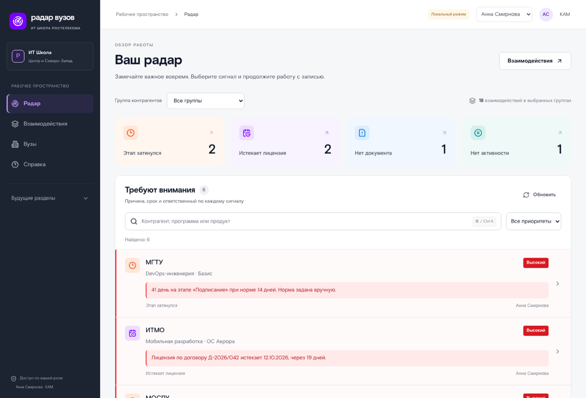
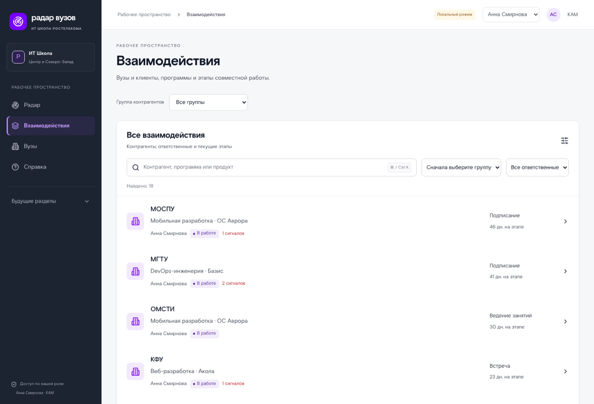
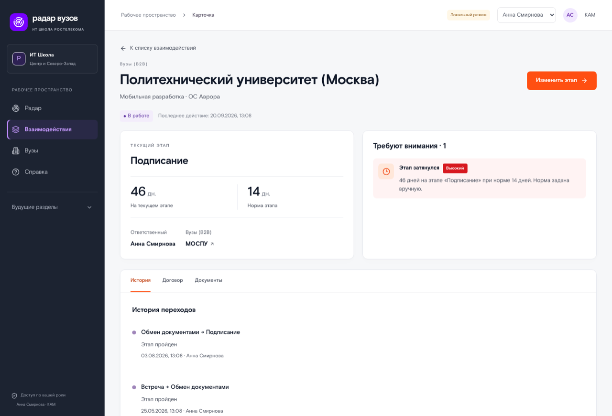
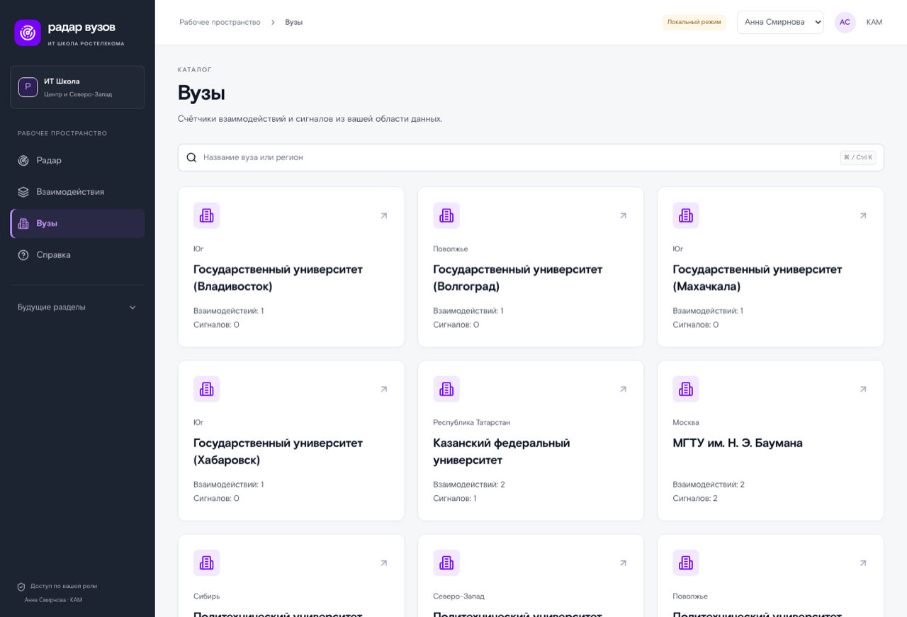

# Руководство пользователя

Этот файл собирается из встроенной справки командой `make help`: те же разделы пользователь
видит в самом продукте (значок «Справка», методы `GET /api/v1/help`). Править нужно исходники
в [`backend/app/help/`](../backend/app/help), а не этот файл.

Эксплуатация стенда — в [руководстве администратора](ADMIN_GUIDE.md); как считаются радар,
нормы и рейтинг — в [методах обработки данных](DATA_PROCESSING.md).

## Содержание
- [С чего начать](#start) — Вход, роли и что видно на первом экране
- [Как ведётся взаимодействие](#interactions) — Этапы, переходы, комментарии, документы и групповые действия
- [Радар: что означают сигналы](#radar) — Четыре сигнала, пороги и что с ними делать
- [Пауза, завершение и отмена](#status) — Состояние записи отдельно от этапа процесса
- [Обучающиеся и преподаватели](#participants) — Список группы по записи, загрузка файлом и работа с почтой
- [Отчёты и выгрузки](#reports) — Как заказать отчёт, какие форматы и что с кодировками
- [Рейтинг востребованности и приоритеты](#rating) — Как считается балл и как задать порядок продвижения вручную
- [Уведомления и переписка](#notifications) — Лента, внешние каналы и обсуждение записи с коллегой
- [Фильтры и сохранённые виды](#views) — Как не набирать одни и те же фильтры каждый день
- [Что настраивает администратор](#admin) — Справочники, правила доступа, процессы, каналы и аудит

## С чего начать

*Кому показывается: admin, kam, manager.*

Вход — через корпоративную учётную запись: на странице входа нажмите «Войти», введите логин
и пароль, система вернёт вас обратно. Отдельного пароля у «Радара вузов» нет.

**Что вы видите, зависит от роли.**

- **КАМ** — свои взаимодействия: вузы и клиенты, с которыми работает он сам.
- **Руководитель** — всю свою команду: записи её КАМов, их сигналы и отчёты; он же назначает
  ответственных, задаёт нормы этапов и веса рейтинга.
- **Администратор** — всё, включая справочники, правила доступа, настройки и журнал аудита.

Область видимости работает везде одинаково: если запись не ваша, она не появится ни в списке,
ни в поиске, ни в отчёте, а прямая ссылка на неё покажет «не найдено». Это не ошибка —
так закрыты чужие данные.

Первый экран — радар: записи, которые требуют внимания сегодня. Ниже — списки и поиск.
Если чего-то не хватает на экране, проверьте фильтры: они запоминаются.

Слева — разделы, вверху справа — кто вы и в какой роли работаете.

## Как ведётся взаимодействие

*Кому показывается: admin, kam, manager.*

Взаимодействие — это связка «контрагент — программа — продукт»: с кем работаем, чему учим
и на чём. Контрагент — вуз (B2B) или клиент, человек или организация (B2C). Продукт бывает
не нужен: часть программ идёт без него.

**Этапы.** Запись движется по процессу своей группы: у вузов один путь, у частных лиц — свой.
В карточке видно, на каком этапе запись, сколько дней она на нём и куда с него можно перейти.
Кнопки показывают только разрешённые переходы — включая возврат на шаг назад, если что-то
забыли.

**Что требуется для перехода.** У перехода может быть обязательный комментарий и обязательный
документ. Если документа нет, кнопка перехода откажет и скажет, какого типа документ нужен;
приложите его на текущем этапе — файл с прошлого этапа не засчитывается.

**Если кто-то изменил запись раньше вас.** Система не даст переписать чужое изменение: вы
увидите «запись изменена, обновите страницу». Обновите — и повторите действие, уже видя
актуальное состояние.

**Несколько записей сразу.** В списке можно отметить записи и перевести их одним действием,
если этап это разрешает, или передать другому КАМу. Система покажет, что получилось,
а что нет и почему: одна неудачная запись не отменяет остальные.

**Заметки.** Короткая заметка в карточке — это и память для себя, и сигнал системе: запись
перестаёт считаться простаивающей.

## Радар: что означают сигналы

*Кому показывается: admin, kam, manager.*

Радар показывает записи, где что-то идёт не так. Сигнал открывается сам, пока выполняется
условие, и закрывается сам, когда условие перестало выполняться. У каждого сигнала есть
числа, по которым он построен, — их видно в карточке.

| Сигнал | Когда появляется | Что делать |
|---|---|---|
| Просрочка этапа | дней на этапе больше нормы | перевести запись дальше или объяснить задержку заметкой |
| Лицензия истекает | до конца лицензии 60 дней и меньше | начать продление, не дожидаясь конца |
| Нет документа | этап требует документ, прошла половина нормы | приложить документ нужного типа |
| Простой | нет переходов, заметок и файлов | связаться с вузом и оставить заметку |

Пороги лицензии и простоя задаёт администратор; по умолчанию простой считается с двух недель,
а серьёзным становится через месяц. Сроки этапов — нормы — задаёт руководитель, и система
подсказывает ему типичный срок по завершённым этапам.

**Записи, по которым долго ничего не происходит, поднимаются выше.** Если запись зависла
не по вашей вине — поставьте её на паузу с причиной: она перестанет копить сигналы
и не будет мешать видеть настоящие проблемы.

## Пауза, завершение и отмена

*Кому показывается: admin, kam, manager.*

Этап говорит, где сделка по регламенту. Состояние — ведётся ли она вообще.

- **В работе** — обычное состояние.
- **Приостановлена** — вуз взял паузу: ждём бюджет, приёмную кампанию, решение ректората.
  Причина обязательна. Пока запись на паузе, сигналы радара по ней не копятся и переходы
  по этапам недоступны.
- **Завершена** — договор отработан. Запись можно переоткрыть, если работа возобновилась.
- **Отменена** — запись заведена ошибочно или сделка не состоялась. Причина обязательна.
  Отменённая уходит из рабочих списков, но остаётся в истории и в отчёте с фильтром
  по состоянию: ничего не удаляется.

**Возврат в работу.** Отменённая запись освобождает связку «контрагент — программа — продукт»,
поэтому на её месте могла появиться другая. Если так и случилось, вернуть старую не получится:
система скажет, что такая запись уже ведётся.

Смена состояния записи видна ответственному: если состояние поменял руководитель, КАМ получит
уведомление с причиной.

## Обучающиеся и преподаватели

*Кому показывается: admin, kam, manager.*

У каждой записи есть список тех, кого по ней учат, и тех, кто ведёт занятия. Список живёт
рядом с записью: отдельного справочника людей в системе нет намеренно.

**Как добавить.** По одному — кнопкой «Добавить», указав ФИО, роль и, если есть, рабочую почту.
Целиком — файлом: JSON, CSV, XLSX или XLS с колонками «ФИО», «Email», «Роль» и «Идентификатор
в LMS». Сначала система покажет предпросмотр по строкам: что появится, что обновится, где
ошибка. Применяется только после подтверждения.

Повторная загрузка того же файла ничего не задваивает: человек находится по почте, а если
почты нет — по ФИО и роли.

**Почта — персональные данные.** В списке она показана сокращённо (`и***@вуз.рф`). Адрес целиком
открывается по кнопке, и каждый такой просмотр, как и выгрузка списка файлом, попадает в журнал
аудита. Это требование закона, а не придирка системы.

**Человек ушёл с обучения** — уберите его из списка: строка исчезнет, а почта будет стёрта.
Хранить её дальше незачем.

Число обучающихся в списке и метрика «обучающиеся» в рейтинге — разные вещи. Список ведёте вы,
метрику отдаёт LMS по вузу и программе за месяц; совпадать они не обязаны.

## Отчёты и выгрузки

*Кому показывается: admin, kam, manager.*

Отчёт строится за период и в фоне: вы заказываете его и продолжаете работать, а когда файл
готов — забираете. В списке отчётов видно состояние и прогресс.

**Что можно настроить.** Период, фильтры (группа, вуз, программа, продукт, ответственный, этап,
состояние) и набор колонок. Отчёт показывает состояние на конец периода, а не сегодняшнее:
этап восстанавливается из истории переходов.

**Форматы.** XLSX и XLS — для Excel, CSV — для загрузки в другие системы, PDF — чтобы отправить
или распечатать, JSON — для интеграции.

**Кодировки.** CSV выгружается в UTF-8 с меткой (Excel откроет без плясок) или в windows-1251,
если принимающая сторона ждёт именно её. Русские буквы не «поедут» ни в одном из вариантов —
это проверяется тестами «выгрузили, загрузили обратно, сравнили».

Отчёт не может увидеть больше, чем видите вы: область видимости применяется и к нему.

## Рейтинг востребованности и приоритеты

*Кому показывается: admin, kam, manager.*

Рейтинг отвечает на вопрос «что востребовано по данным». Считается по трём метрикам: заявки
с сайта, обучающиеся и потоки из LMS. У каждой метрики свой вес, сумма весов — 100; веса
по умолчанию задаёт руководитель, а в самом рейтинге их можно покрутить и сразу увидеть другой
порядок.

**Сравнение идёт внутри направления.** Число заявок на DevOps и на блокчейн сравнивать
бессмысленно: аудитории разного размера. Внутри направления лучший получает 100 баллов,
остальные — свою долю от него.

**Неполные данные не прячутся.** Если метрики за период нет, она исключается, её вес
распределяется между остальными, а строка помечается как неполная — это видно рядом с баллом.

**Изменение места** считается относительно предыдущего периода такой же длины. Если раньше
записи не было, изменение не показывается вовсе, а не выдаётся за рост.

**Ручной приоритет.** Решение «что продвигаем в этом году» остаётся за человеком: руководитель
и администратор ставят курсу приоритет от 0 до 100. Отмеченные курсы идут первыми в справочнике
и в рейтинге в режиме «по приоритету», но балл и место при этом не меняются — они всегда
посчитаны по данным. Так видно, где расчёт, а где решение.

## Уведомления и переписка

*Кому показывается: admin, kam, manager.*

**Лента уведомлений** — значок в шапке. Туда приходят зависшие записи, переходы, сделанные
не вами по вашей записи, смена ответственного и перенос записей при изменении процесса.
Прочитанные уходят из непрочитанных, но остаются в ленте.

**Внешние каналы.** Те же уведомления можно получать в Telegram, Max или на почту. Адрес
указывается в профиле, каналы включает администратор. Во внешний канал уходит только заголовок
события и ссылка: персональные данные и содержание записи в мессенджер не передаются.

**Переписка с коллегой.** Внутри системы есть личные сообщения: обсудить запись с руководителем
можно, не выходя в сторонний мессенджер. К сообщению прикладывается ссылка на вашу запись —
собеседник увидит её, если запись доступна и ему. Переписку видят только двое: ни другой КАМ,
ни администратор чужой диалог не откроют. Наружу переписка не пересылается.

**Зависшая запись уходит выше.** Если по записи долго ничего не происходит, уведомление получает
не конкретный человек, а роль — руководитель команды или администраторы. Срок задаёт
администратор.

## Фильтры и сохранённые виды

*Кому показывается: admin, kam, manager.*

Списки фильтруются по группе, вузу или клиенту, направлению, программе, продукту,
ответственному, этапу, состоянию, числу дней на этапе и открытым сигналам. Поиск ищет
по названию контрагента и программе.

Набор фильтров и колонок можно сохранить под своим названием — например «Мои просрочки»
или «B2C в работе». Сохранённые виды личные: у коллеги их нет, даже у администратора.
Название в пределах страницы занимается один раз, но на другой странице то же название
свободно.

Вид хранит настройки списка, а не сами данные: он всегда показывает то, что в системе
сейчас.

## Что настраивает администратор

*Кому показывается: admin.*

- **Справочники** — вузы, направления, программы, вендоры, продукты и их связи. Заводятся
  по одной записи или файлом: JSON, CSV, XLSX, XLS с предпросмотром по строкам. Повторная
  загрузка того же файла не создаёт дублей, пустая ячейка не стирает заполненное поле.
  Выгрузка отдаёт ровно те колонки, которые принимает загрузка.
- **Группы контрагентов** — «Вузы (B2B)», «Частные лица (B2C)» и новые группы. У каждой свой
  процесс; новая группа заводится на уже опубликованном процессе.
- **Процессы** — этапы, их порядок, правила переходов и требования к комментарию и документу.
  Изменения готовятся черновиком и применяются ко всем открытым записям сразу; перед
  публикацией окно подтверждения показывает, что переименовано, что удалено и куда переедут
  записи. Переименование этапа доступно только администратору.
- **Правила доступа** — точечные разрешения и запреты по вузу, направлению, программе или
  группе. Запрет сильнее разрешения и убирает записи из всех списков, сигналов и отчётов.
- **Настройки** — пороги радара и срок, после которого зависшая запись уходит вышестоящей роли.
- **Каналы уведомлений** — Telegram, Max и почта: включение, адрес и виды событий. Секрет
  канала хранится в переменных окружения, в базе — только имя переменной.
- **Журнал аудита** — кто что изменил и кто смотрел персональные данные. Журнал только
  дописывается.

Эксплуатация стенда — установка, обновление, резервные копии, разбор происшествий —
в руководстве администратора репозитория: `docs/ADMIN_GUIDE.md`.
