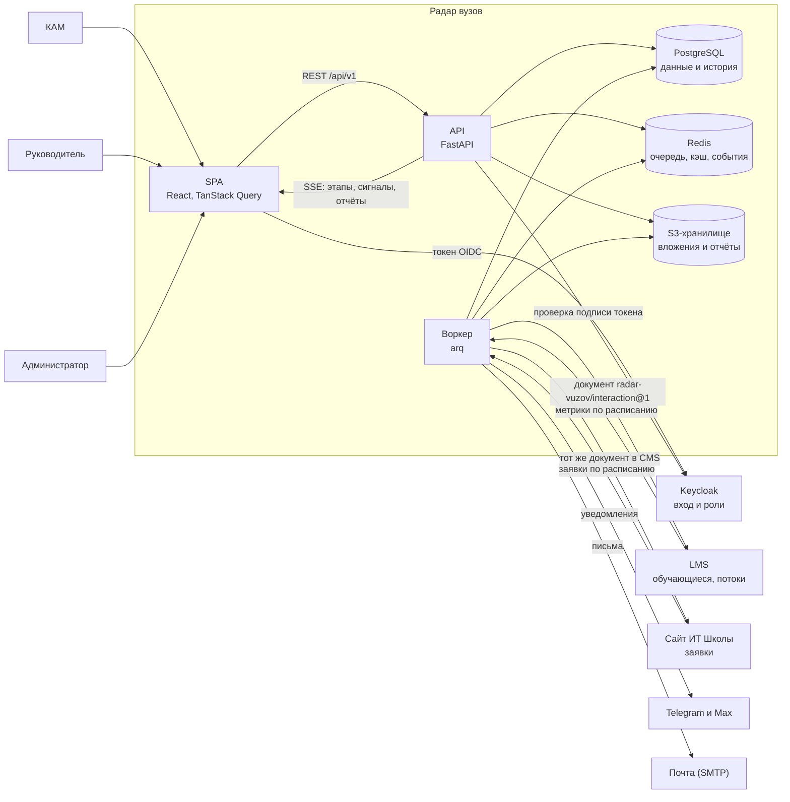
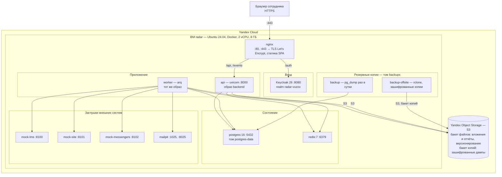
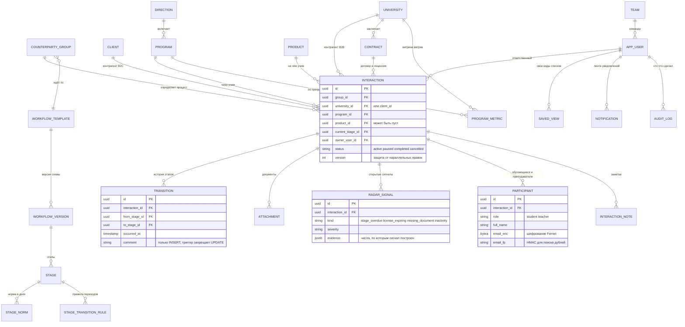

# Диаграммы «Радара вузов»

Три диаграммы, которые просило жюри: связи системы, программно-аппаратная архитектура и база
данных. Исходники — Mermaid прямо в этом файле, GitHub рисует их сам. Полная модель в ArchiMate
лежит рядом: [`model.xml`](model.xml), открывается в Archi (File → Import → Model from Open
Exchange File).

Пояснения к решениям — в [`ARCHITECTURE.md`](../../ARCHITECTURE.md), расчёты — в
[`DATA_PROCESSING.md`](../DATA_PROCESSING.md).

Те же диаграммы отрисованы в картинки — [`images/`](images): они идут в сопроводительный PDF
и в презентацию, где Mermaid не нарисуешь. Пересобрать после правки исходников:
`make docs-pdf` вставит свежие файлы, а сами картинки снимаются headless-браузером: страница
с диаграммой mermaid 11 открывается в Chrome, у отрисованного SVG берутся настоящие ширина
и высота, и снимок делается ровно под них (`--headless --window-size=W,H --screenshot`).

## 1. Диаграмма связей

Кто с кем разговаривает и по какому поводу. Стрелка — направление вызова, подпись — что передаётся.

**Что здесь важно.** Обмен двусторонний: входящий — по расписанию, исходящий — очередью
`integration_outbox`, чтобы отказ получателя не ронял работу КАМа (ADR-018). Уведомления уходят
из воркера, а не из запроса: медленный мессенджер не должен задерживать переход по этапу
(ADR-016). Права проверяет только API — SPA лишь прячет недоступное.

## 2. Программно-аппаратная архитектура

Стенд — одна виртуальная машина в Yandex Cloud: всё поднимается `docker compose` из
[`infra/docker-compose.prod.yml`](../../infra/docker-compose.prod.yml) с дополнением
[`docker-compose.yandex.yml`](../../infra/docker-compose.yandex.yml). Файлы лежат не на машине,
а в Yandex Object Storage — облачном S3-хранилище. Наружу открыты только 80 и 443 (и 22 для
администратора). В закрытом контуре заказчика вместо Object Storage ставится MinIO или другое
S3-хранилище — код тот же, меняются адрес и ключи.

**Масштабирование.** Узкое место — API: он без состояния, поэтому добавляется копиями за тем же
nginx. Воркер тоже масштабируется копиями: очереди обмена и уведомлений захватываются арендой
(`locked_until`) и `SKIP LOCKED`, поэтому две копии не отправят одно и то же дважды. Тяжёлое
чтение (рейтинг, справочники) снимается кэшем в Redis (ADR-022), файлы лежат в S3 и не грузят
базу. Подробности и замеры — в [`LOAD_TEST.md`](../LOAD_TEST.md).

## 3. База данных

Главные таблицы и связи между ними. Полная модель со всеми полями — в разделе «Модель данных»
[`ARCHITECTURE.md`](../../ARCHITECTURE.md); служебные таблицы импорта, интеграций и уведомлений
здесь опущены, чтобы схема читалась.

**Что важно в схеме.** Контрагент у записи ровно один: либо вуз, либо клиент — условие проверяет
база (ADR-015). Частичные уникальные индексы не дают завести вторую активную запись по той же
связке «контрагент — программа — продукт». История переходов и журнал аудита только дописываются:
это обеспечивает триггер, а не договорённость.
